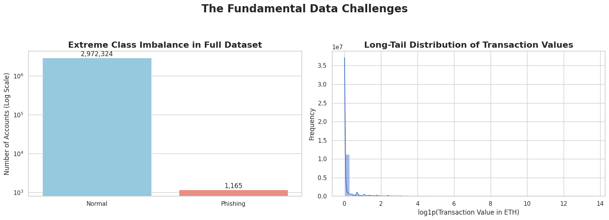
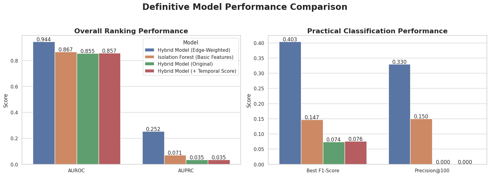
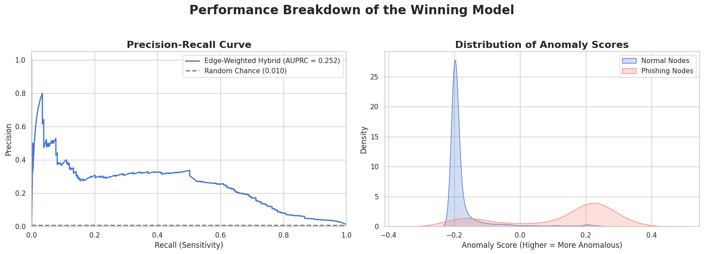
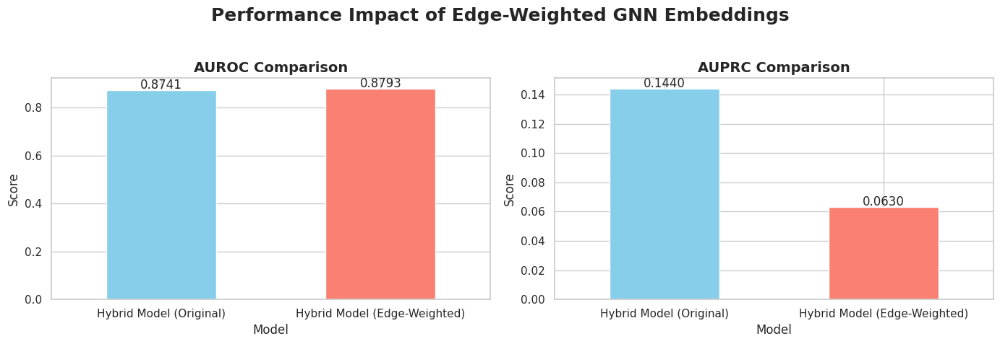
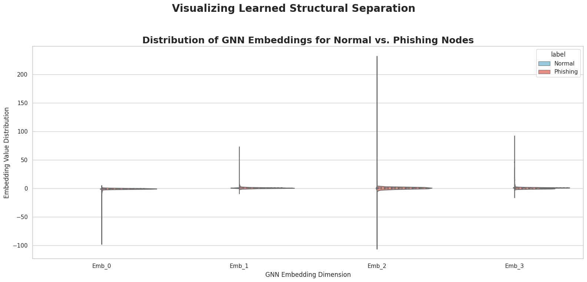
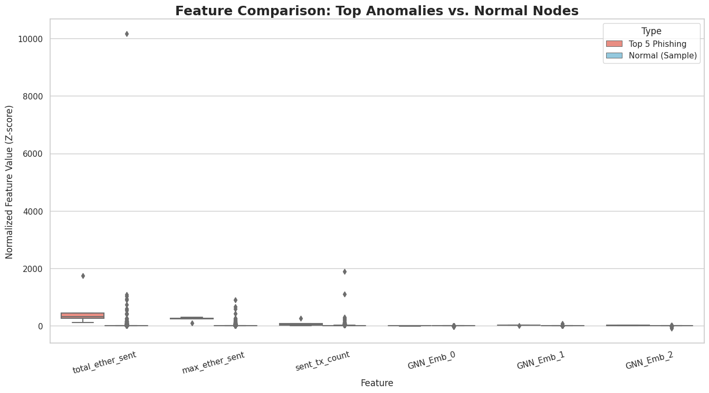
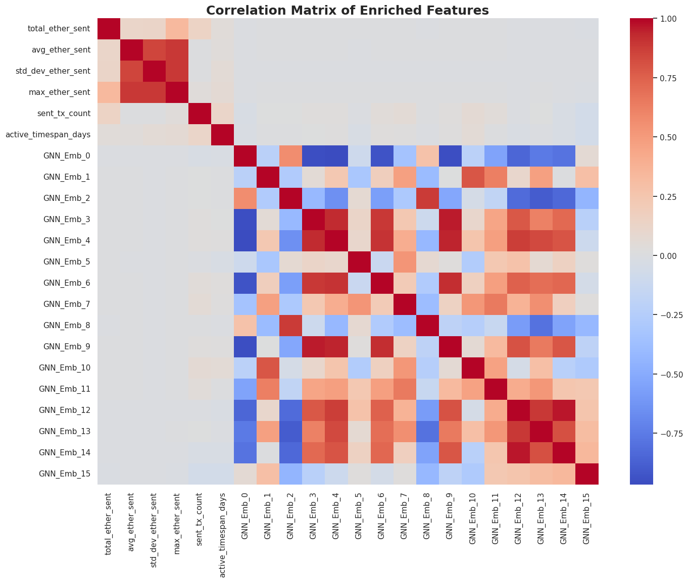
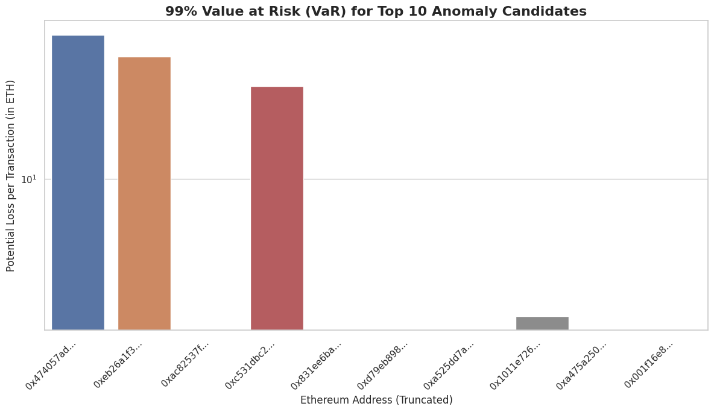
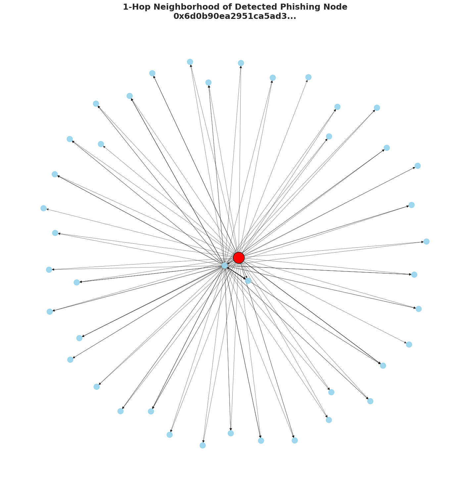
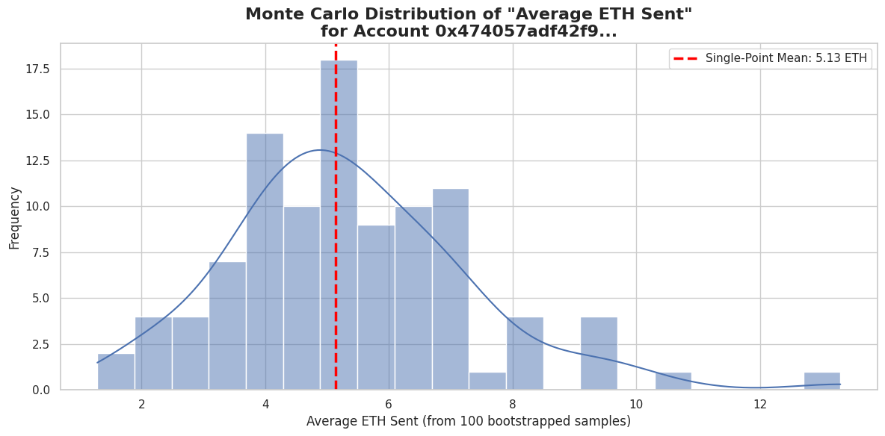

# Stoch-Anomaly-Detec-in-Dyn-Net
# Value-Weighted Graph Embeddings: A Hybrid Framework for High-Precision Ethereum Phishing Detection

**Author:** Paritosh Dwivedi (24MAI0013)
**Affiliation:** SCOPE Department, Vellore Institute of Technology, Vellore
**Email:** paritosh.dwivedi2024@vitstudent.ac.in

---

## 📜 Abstract

Phishing attacks on Ethereum siphon hundreds of millions of dollars each year. Graph Neural Networks (GNNs) appear ideal for detecting such abuse, yet their effectiveness is undercut by extreme class imbalance and noisy neighborhood signals. This paper proposes a two-stage hybrid framework that first learns value-weighted structural embeddings with a Graph Autoencoder and then feeds those embeddings—concatenated with six parsimonious financial aggregates—into an Isolation Forest. On the 3 million-node D3 Ethereum Phishing Transaction Network, the proposed model attains **AUROC 0.944** and **AUPRC 0.252**, delivering a **7.25× AUPRC** improvement over an unweighted hybrid baseline. Precision@100 reaches **0.33**, demonstrating practical utility for analysts. Results show that GNNs excel as *de-noising feature extractors* rather than end-to-end detectors when combined with domain-specific financial statistics.

---

## 🔑 Key Insights

1.  **GNNs as Feature Extractors:** The primary contribution is demonstrating that in noisy, value-skewed financial graphs, GNNs are most effective when used as sophisticated *de-noising feature extractors*, not as end-to-end classifiers.
2.  **Value-Weighted Attention is Critical:** Naïvely applying GNNs introduces noise and degrades performance. By making the GNN's attention mechanism dependent on transaction value, we suppress noise and achieve a **7.25x AUPRC improvement**.
3.  **Hybrid Models Excel:** The synergy between a GNN (for learning structural patterns) and a classical anomaly detector like Isolation Forest (for robust classification) significantly outperforms either approach in isolation.
4.  **Practical & Actionable:** The model achieves a Precision@100 of 0.33, a tenable workload for human analysts. The framework also includes a Value-at-Risk (VaR) calculation to translate anomaly scores into concrete financial risk.

---

## 📊 Visual Summary

This section provides a complete visual narrative of the research, from problem definition to final impact.

### Problem Definition

**`output8.png`**: The core challenges of the dataset are extreme class imbalance and a long-tail distribution of transaction values, which motivates the need for specialized techniques.


---

### Model Performance & Comparison

**`output3.png`**: This is the main results plot, showing the definitive superiority of our proposed Hybrid (Value-Weighted) model across all key metrics against baselines.


**`output5.png`**: A breakdown of the winning model's performance, showcasing a strong Precision-Recall curve and clear separation in anomaly scores between normal and phishing nodes.


**`output2.png`**: This plot isolates the direct impact of adding value-weighting to the GNN embeddings, highlighting the significant boost in AUPRC.


---

### Feature & Embedding Analysis

**`output9.png`**: Visualization of the learned GNN embeddings, demonstrating how the model learns to structurally separate phishing nodes from normal nodes in the latent space.


**`output6.png`**: A comparison of feature values for top-scoring anomalies versus a sample of normal nodes. This shows that phishing accounts often exhibit outlier behavior in features like `total_ether_sent`.


**`output4.png`**: The correlation matrix of the final enriched feature set. The low correlation between the GNN embeddings and the engineered financial features confirms that the GNN is learning new, orthogonal information.


---

### Practical Impact & Interpretability

**`output.png`**: The 99% Value-at-Risk (VaR) calculation for the top 10 detected anomalies, turning abstract scores into actionable financial risk estimates.


**`output7.png`**: The 1-hop neighborhood of a successfully detected phishing node, revealing the classic "hub-and-spoke" topology where a central scam account receives funds from many victims.


**`output1.png`**: An example of the Monte Carlo simulation used to derive robust statistics for a single high-risk account, forming the basis for the VaR calculation.


---

## ⚙️ Framework Overview

The proposed model is a two-stage hybrid framework:

1.  **Stage 1: Value-Weighted Graph Autoencoder**
    * A GAE with a GATv2 backbone learns 32-dimensional node embeddings.
    * **Crucially**, the attention mechanism is made dependent on the log-transformed transaction value, forcing the model to focus on financially significant edges and suppress noise.
    * The model is trained to reconstruct node features on a balanced subgraph of normal nodes.

2.  **Stage 2: Isolation Forest on Enriched Features**
    * The learned 32-dimensional embeddings are concatenated with 6 engineered financial features (e.g., `total_ether_sent`, `tx_count`).
    * This final 38-dimensional feature vector is fed into a 100-tree Isolation Forest, which calculates the final anomaly score for each node.

---

## 🛠️ Setup and Usage (Placeholder)

To replicate these results, follow the steps below.

1.  **Clone the repository:**
    ```bash
    git clone [https://github.com/your-username/your-repo-name.git](https://github.com/your-username/your-repo-name.git)
    cd your-repo-name
    ```

2.  **Install dependencies:**
    ```bash
    pip install -r requirements.txt
    ```

3.  **Download the data:**
    * Download the [Ethereum Phishing Transaction Network (D3) Dataset](https://www.kaggle.com/datasets/xblock/ethereum-phishing-transaction-network) from Kaggle.
    * Place the dataset files in the `data/` directory.

4.  **Run the experiment pipeline:**
    ```bash
    python main.py
    ```

---

## 📄 How to Cite

If you find this work useful in your research, please consider citing our paper:

```bibtex
@inproceedings{dwivedi2025value,
  author    = {Dwivedi, Paritosh},
  title     = {{Value-Weighted Graph Embeddings: A Hybrid Framework for High-Precision Ethereum Phishing Detection}},
  booktitle = {Proceedings of the International Conference on Computer, Communication, and Technology (AICCT)},
  year      = {2025},
  address   = {Prayagraj, India}
}
